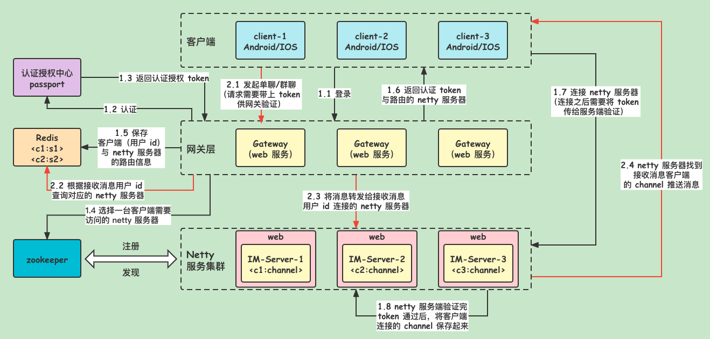

# 即时通讯工具项目（Shura-IM）

## 简介

`Shura-IM` 一款面向开发者的`IM（即时通讯）`系统，提供了一些组件帮助开发者构建一款属于自己的可水平扩展的 `IM`

借助 `Shura-IM` 可以实现以下需求：
- `IM` 即时通讯系统
- 适用于 `APP` 的消息推送中间件

## 系统架构

- `Shura-IM` 中的各个组件均采用 `Spring Boot` 构建。
- 采用 `Netty` 构建底层通信。
- `Redis` 存放各个客户端的路由信息、账号信息、在线状态等。
- `Zookeeper` 用于 `IM-Server` 服务的注册与发现。
- 目前认证逻辑只做了简单实现，后续有时间可以优化

### im-server

`IM` 服务端：用于接收 `client` 连接、消息透传、消息推送等功能。

**支持集群部署。**

### im-gateway

消息路由网关：用于处理消息路由、消息转发、用户登录、用户下线以及一些运营工具（获取在线用户数等）。

### im-client

`IM` 客户端；给用户使用的消息终端，一个命令即可启动并向其他人发起通讯（群聊、私聊）。

## 流程图



- 客户端向 `gateway` 发起登录。
- 登录成功从 `Zookeeper` 中选择可用 `IM-server` 返回给客户端，并保存登录、路由信息到 `Redis`。
- 客户端向 `IM-server` 发起长连接，成功后保持心跳。
- 客户端下线时通过 `gateway` 清除状态信息。

## 快速启动

首先需要安装 `Zookeeper`、`Redis` 并保证网络通畅。

### 部署网关服务器(im-gateway)

直接运行 `GatewayApplication.java`
> `im-gateway` 本身就是无状态，可以部署多台；使用 `Nginx` 代理即可。

### 部署服务端(im-server)

直接运行 `IMServerApplication.java`

### 启动客户端(im-client)

直接运行 `IMClientApplication.java`

### 接口

#### 注册账号

```shell
curl -X POST --header 'Content-Type: application/json' --header 'Accept: application/json' -d '{
  "reqNo": "18266668888",
  "timeStamp": 1641271091,
  "userName": "garvey"
}' 'http://路由服务器:8090/registerAccount'
```

从返回结果中获取 `userId`,写入客户端项目 im-client 的配置文件里

```json
{
  "code": "9000",
  "message": "成功",
  "reqNo": null,
  "dataBody": {
    "userId": 1633614560039,
    "userName": "garvey"
  }
}
```

## 客户端内置命令

| 命令 | 描述|
| ------ | ------ | 
| `:q!` | 退出客户端| 
| `:olu` | 获取所有在线用户信息 | 
| `:all` | 获取所有命令 | 
| `:q [option]` | 【:q 关键字】查询聊天记录 | 
| `:ai` | 开启 AI 模式 | 
| `:qai` | 关闭 AI 模式 | 
| `:pu` | 模糊匹配用户 | 
| `:info` | 获取客户端信息 |

### 聊天记录查询

使用命令 `:q 关键字` 即可查询与个人相关的聊天记录。

> 客户端聊天记录默认存放在 `/opt/logs/im/`，所以需要这个目录的写入权限。也可在启动命令中加入 `--im.msg.logger.path = /自定义` 参数自定义目录。

### 前缀匹配用户名

使用命令 `:pu prefix` 可以按照前缀的方式搜索用户信息。

> 该功能主要用于在移动端中的输入框中搜索用户。

### 群聊/私聊

#### 群聊

群聊只需要在控制台里输入消息回车后即可发送，同时所有在线客户端都可收到消息。

#### 私聊

私聊首先需要知道对方的 `userId` 才能进行。

输入命令 `:olu` 可列出所有在线用户。

接着使用 `userId::消息内容` 的格式即可发送私聊消息。